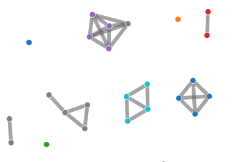

Reports
~~~~~~~

Below are descriptions of reports generated by the centreseq core module. Examples follow where applicable.

Summary Report
^^^^^^^^^^^^^^
Large .tsv file containing detailed information for each cluster detected by centreseq.
Displays representative sequence label, number of members, and which sequence labels belong to the cluster.

Core Gene Count Report
^^^^^^^^^^^^^^^^^^^^^^
Contains general metrics on the # of core genes detected among 100% of samples, >=90% of samples, and >50% of samples.

.. code-block:: none

    # genes shared among 100% of samples:	2497
    # genes shared in >=90% of samples:	3548
    # genes shared in >=50% of samples:	3991

    Results were generated with:
        min_seq_id	= 0.95
        coverage_length	= 0.95

Roary Gene Count Report
^^^^^^^^^^^^^^^^^^^^^^^
Gene count report represented in the style of Roary's output.

.. code-block:: none

    Core genes	(99% <= strains <= 100%)	3334
    Soft core genes	(95% <= strains < 99%)	178
    Shell genes	(15% <= strains < 95%)	1311
    Cloud genes	(0% <= strains < 15%)	21966
    Total genes	(0% <= strains <= 100%)	26789

    Results were generated with:
        min_seq_id	= 0.95
        coverage_length	= 0.95

Pairwise Report
^^^^^^^^^^^^^^^
Large .tsv file which stores pairwise information between samples on the number of matching genes and non-matching
genes among the intersection of all genes existing between the two. Used to generate the network visualization.

Network Chart
^^^^^^^^^^^^^
Interactive visualization generated from the pairwise report file.

Gene Count Curve
^^^^^^^^^^^^^^^^
Visualization generated showing the # of 'core' genes vs. the # of 'pan' genes with increasing numbers of
sampled genomes.

.. image:: images/gene_count_curve.png
  :width: 600
  :alt: Example gene count curve

Looping over a range from 1..n, the following process is executed,

    1) n samples are randomly selected
    2) Number of core genes shared between the subset calculated
    3) Total number of genes existing among the subset is calculated

By default, this entire process is repeated 5 times to reduce variance from the random sampling.
